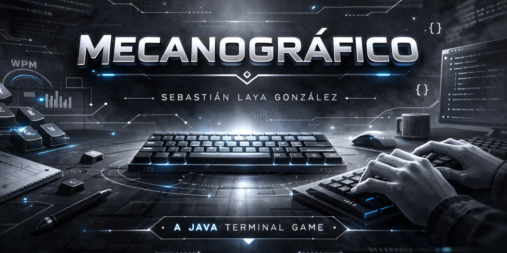

 

  

## Introducción

Mecanográfico es un **minijuego** para practicar tu velocidad de escritura desde la terminal. **Cronometra** tu tiempo en copiar una frase y cuenta los **errores** del usuario en comparación a la cadena original de texto, la cual se escoge aleatoriamente de un repertorio de más de **100** frases. Por úlitmo también se puede escoger una **dificultad**, que determinará la longitud de la cadena de texto a escribir 

## Descarga

En "Releases" o en este [enlace](https://github.com/slayaglez/Mecanografico/releases/tag/v1.0.5) puedes escoger el instalador para tu sistema operativo. Las descargas, respectivamente, son las siguientes:

- Windows - ` Mecanografico-1.0.exe `
- Linux - ` mecanografico_1.0-1_amd64.deb `
- Mac - ` Mecanografico-1.0.dmg `

Ya no es necesario tener instalado Java 17 o Maven en tu equipo.
 

